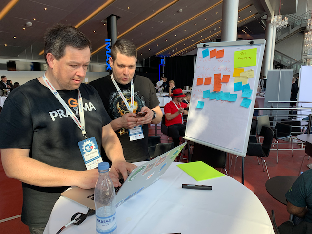
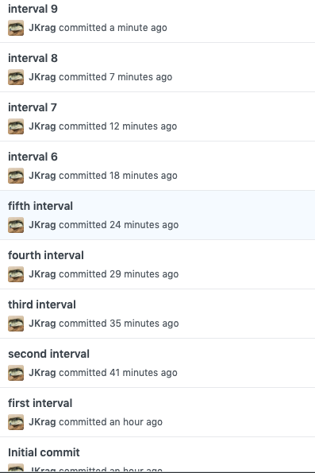

# Mob programming tips & tricks

## Mobsters
John Behrens: john.behrens@skills-for-teams.com
Jan Krag: @jankrag
Anders Nyvang: @nyvanga

## Intro
Guide created at DevOpsDaysCPH 2019, as a result of a "Mob blogging" session summarizing the open space discussion before on the topic of Mob programming tips and tricks.

Wedensday there were two mob programming sessions by @EmilyBache and Nicolaj (something, links and stuff!).

## Tips & Tricks

### Use a timer
* Sand clocks were suggested. "Silent alarm", as some don't like beeps.
* Mob Timer apps [Mobster.cc](https://mobster.cc) 
* 5-10 minutes is a good interval. For this blogging, we are going with 5:30
* Some teams write their own. 
  * Interval timer angular app.
  * Writing a timer is a good mob practise exercise
* Research: Are there any IDE plugins?

### Period length
5-10 minutes per interval, but sessions can go on for multiple hours. Don't forget frequent breaks.
Some suggested a period that allows each team member at least 2 sits as driver.

### Observer group
Emily suggestet size as big as a Scrum Team
For more than six you have a lot of relationships in the room that need to be managed.
For bigger groups, maybe split team, so 5-6 are in rotation, the rest are "observers". 

### Experts as the Driver or Not
* Put experts in the mob
 * prevents the team from beeing out of knowledge
* Experts as driver
 * force others to find out themself
 * forces the expert to be silent

## Teching mob programing 
- which exercises to use
   FizzBuzz and other coding Katas
   Wargames
   Refactoring Katas, Tennis for example
   
* choose Focus of the Exercise
 * Teaching TDD
 * Teaching the Mob Programming
 * Teach Editors
 * Teach new Language 
 
* Don´t teach too much at once    
* suggestion: only rotate the driver with an experienced navigator

## Distrubuted teams

A few tools were mentioned:

* [Etherpad](etherpad.org)
* VSCode code share
* Online IDE's

## Pitfalls
### Common problems
* Wierd IDE/editor setup
* uncommon keyboard layout (language doesn't match)
* Blaming culture
* ego
* Gettings stuck on *solving* the problem

### Solutiuons
* Have a good IDE
* Kindness & respect environment
* Instigate a good feedback culture
* Focus on the mob process
* Tech checklist
* Pay attention to feelings & atmosphere
 
## When to use

## Mob [what]
- Use for Failure Days 
- [Wargames](http://overthewire.org/wargames/)
- Exploratory Testing
- Mob Debugging
- Technical Debt Refactoring
- Requirment Engineering (Gherkin, Storys)
- 

## The facilitator
Facilitator is realy usefull when you start with mob programming.
It could be a scrum master or a non programmer or not participating programming. Experienced teams could do it alone, but a facilitator could help them focus on advanced techniques.

A big thanks to the ThoughWorks/GoCD booth for lending us their big screen for an hour.
